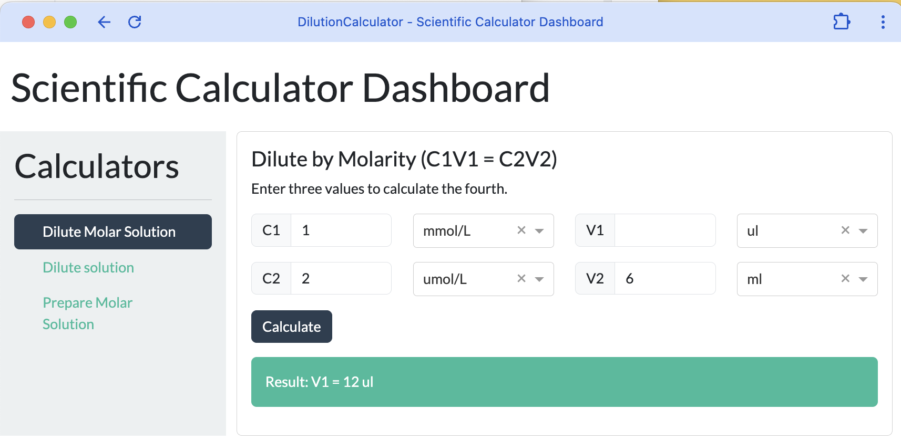
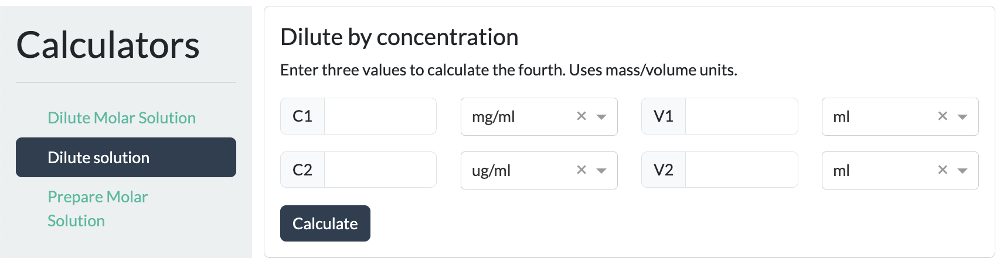

# Scientific Calculator Dashboard

A web-based dashboard built with Python and Dash to perform common scientific and laboratory calculations. The application features a modular design that is easy to extend with new calculators.

-----

## Screenshot



-----

## ✨ Features

* **Web-Based Interface**: Accessible from any modern web browser.
* **Multiple Calculators**:
  * Molarity Dilution ($C\_1V\_1 = C\_2V\_2$)
  * Mass Concentration Dilution ($C\_1V\_1 = C\_2V\_2$)
  * Mass from Volume, Concentration, and Molar Mass
* **Automatic Unit Conversion**: Each input has a dropdown with relevant units (e.g., mol/L, mmol/L, nmol/L), and calculations are handled automatically.
* **Extensible by Design**: The application is structured to make adding new calculators simple and straightforward.
* **Secure Configuration**: Keeps private user paths out of the main script using a `.env` file.
* **Easy Startup**: A convenient bash script (`start_app.sh`) handles environment activation and app launch.

-----

## 🛠️ Technologies Used

* **Backend**: Python
* **Dashboard Framework**: Plotly Dash
* **UI Components**: Dash Bootstrap Components
* **Environment Management**: Python Virtual Environment (`venv`)
* **Automation**: Bash Script

-----

## 🚀 Setup and Installation

Follow these steps to set up and run the project locally.

### 1\. Prerequisites

* Python 3.8+
* A Python virtual environment tool (like `venv`)

### 2\. Clone the Repository

```bash
git clone <your-repository-url>
cd <your-repository-name>
```

### 3\. Set Up the Environment

Create and activate a Python virtual environment.

```bash
# Create the virtual environment
python3 -m venv venv

# Activate it
source venv/bin/activate
```

### 4\. Install Dependencies

Install all the necessary Python packages from the `requirements.txt` file.

```bash
pip install -r requirements.txt
```

### 5\. Configure Environment Variables

The application uses a `.env` file to manage private paths.

First, create a `.env` file from the example template.

```bash
cp .env.example .env
```

Now, edit the `.env` file and add the correct paths for your system.

**`.env` file content:**

```env
# Configuration for the Dash App launcher
VENV_PATH="~/path/to/your/venv/bin/activate"
APP_DIR="~/path/to/your/project/directory"
```

-----

## How to run

Once the setup is complete, you can run the application using the startup script.

First, make the script executable (you only need to do this once):

```bash
chmod +x startCalculator.sh
```

Then, run the script:

```bash
./startCalculator.sh
```

The script will automatically activate the virtual environment, start the Dash server, and open the application in your default browser.

-----

## 🧩 How to Add a New Calculator

This project is designed to be easily expanded. To add a new calculator:

1. **Define New Units (If Necessary)**: At the top of `calc.py`, add a new unit dictionary if your calculator requires units not already defined.

2. **Create the Layout and Callback**:

   * Create a new `dbc.Card` layout variable (e.g., `my_new_calculator_layout`).
   * **Important**: Ensure all component `id`s within your new layout are unique.
   * Create a new `@callback` function that targets the unique IDs from your new layout to perform the calculation logic.

3. **Register the Calculator**: Add your new calculator to the main `CALCULATORS` dictionary in `calc.py`. This will automatically add it to the sidebar navigation.

   ```python
   CALCULATORS = {
       # ... existing calculators
       "/new-calculator": {"name": "My New Calculator", "layout": my_new_calculator_layout},
   }
   ```

-----

## 📄 License

This project is licensed under the MIT License. See the `LICENSE` file for details.